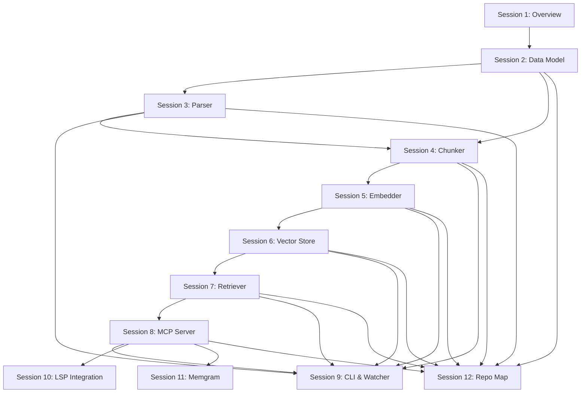

# codebase-context — Teaching Curriculum

## Session Dependency Map

<!-- AID: diagram — Simplified linear version of the above for slide use -->

---

## Session 1 — What Is codebase-context and Why It Exists

**Learning objectives:**
- Understand the problem this tool solves for Claude Code agents
- Understand what MCP is and how this tool plugs into it
- Build a high-level mental map of all major components before diving into any one of them

**Key concepts:** Claude Code, MCP (Model Context Protocol), semantic search, vector embeddings, LSP, agent memory

**Primary source files:**
- `codebase_context/cli.py`
- `codebase_context/mcp_server.py`
- `codebase_context/config.py`

<!-- AID: diagram — High-level component map: CLI → Indexer → Parser/Chunker/Embedder/Store → MCP Server → Claude Code -->
<!-- AID: diagram — Where codebase-context fits in a Claude Code session: agent sends tool call → MCP server → retriever → response -->

### Content

> _Stub — to be filled in._

---

## Session 2 — Core Data Model: Symbol and Chunk

**Learning objectives:**
- Understand `Symbol` — the central type produced by parsing
- Understand `Chunk` — the central type consumed by the vector store
- Understand `IndexMeta` and `IndexStats` — the index state types

**Key concepts:** dataclass, Symbol fields, Chunk fields, deterministic ID, metadata dict, IndexMeta, config constants

**Primary source files:**
- `codebase_context/parser.py` — `Symbol` (lines 26–37)
- `codebase_context/chunker.py` — `Chunk` (lines 14–18)
- `codebase_context/models.py` — `IndexMeta` (lines 8–14), `IndexStats` (lines 17–20)
- `codebase_context/config.py` — all constants

<!-- AID: diagram — Symbol fields annotated: name, type, start/end line, source, signature, docstring, calls, parent, filepath, language -->
<!-- AID: diagram — Chunk fields annotated: id (SHA-256), text (context-prefixed), metadata (mirrors Symbol + full_source) -->

### Content

> _Stub — to be filled in._

---

## Session 3 — The Parser

**Learning objectives:**
- Understand how raw source files become `Symbol` objects using tree-sitter
- Understand the per-language handler pattern and why it exists
- Understand what happens with unsupported languages and parse errors

**Key concepts:** tree-sitter, CST (Concrete Syntax Tree), language handler protocol, `@lru_cache`, signature extraction, call extraction, symbol types

**Primary source files:**
- `codebase_context/parser.py`

**Key symbols:**
- `parse_file(filepath)` — line 277 — public API
- `_load_language(extension)` — line 124 — cached language loader
- `extract_signature(node, ...)` — line 143
- `extract_calls(node, source_bytes)` — line 170
- `_extract_class_methods(...)` — line 217
- `LanguageHandler` (Protocol) — line 45
- `_PythonHandler` — line 60
- `_TypeScriptHandler` — line 90

<!-- AID: diagram — AST walk flow: source bytes → tree-sitter parse → CST root → walk top-level nodes → dispatch per node type → Symbol list -->
<!-- AID: code-walkthrough — Show a Python function being parsed: source → CST node → signature extraction → Symbol fields populated -->

### Content

> _Stub — to be filled in._

---

## Session 4 — The Chunker

**Learning objectives:**
- Understand why a separate chunking step exists between parsing and embedding
- Understand how context prefixes make embeddings more accurate
- Understand chunk ID determinism and why it enables idempotent upserts

**Key concepts:** context prefix, token budget, SHA-256 chunk ID, `full_source` vs `text`, metadata dict

**Primary source files:**
- `codebase_context/chunker.py`

**Key symbols:**
- `chunk_id(filepath, symbol_name, start_line)` — line 21
- `build_chunks(symbols, filepath)` — line 30
- `_truncate_to_tokens(text, max_tokens)` — line 77
- `MAX_CHUNK_TOKENS` — `config.py` line 16 — 512 tokens default

<!-- AID: code-walkthrough — Show a Symbol going through build_chunks: input Symbol → context prefix assembled → truncation check → Chunk output -->
<!-- AID: diagram — Context prefix format: filepath comment + type/class comment + signature + source body -->

### Content

> _Stub — to be filled in._

---

## Session 5 — The Embedder

**Learning objectives:**
- Understand how chunk text becomes a vector using fastembed
- Understand the `EmbeddingProvider` protocol and why it exists
- Understand the airgapped (offline) model seeding mechanism

**Key concepts:** fastembed, ONNX, HuggingFace cache, `EmbeddingProvider` Protocol, dependency injection, lazy loading, double-checked locking, batch size

**Primary source files:**
- `codebase_context/embedder.py`

**Key symbols:**
- `EmbeddingProvider` (Protocol) — line 22
- `Embedder._get_model()` — line 124 — lazy init with double-checked locking
- `Embedder.embed(texts)` — line 145 — batched embedding
- `Embedder._seed_local_to_hf_cache(cache_dir, models_dir)` — line 47 — airgapped support
- `Embedder._resolve_models_dir()` — line 103
- `EMBED_MODEL` — `config.py` line 7 — `jinaai/jina-embeddings-v2-base-code`

<!-- AID: diagram — EmbeddingProvider as injection point: Indexer / Retriever / mcp_server all accept EmbeddingProvider | None -->
<!-- AID: diagram — Model resolution order: CC_MODELS_DIR env → models/ in project root → empty (download from HF) -->

### Content

> _Stub — to be filled in._

---

## Session 6 — The Vector Store

**Learning objectives:**
- Understand how vectors and metadata are persisted in ChromaDB
- Understand how cosine similarity search works at the API level
- Understand how the store handles multi-project isolation and file-level deletion

**Key concepts:** ChromaDB, cosine similarity, HNSW index, collection naming, `SearchResult`, upsert idempotency, metadata filters

**Primary source files:**
- `codebase_context/store.py`

**Key symbols:**
- `VectorStore.__init__(project_root)` — line 32
- `VectorStore._get_or_create_collection()` — line 39 — `hnsw:space: cosine`
- `VectorStore.upsert(chunks, embeddings)` — line 45
- `VectorStore.search(query_embedding, top_k, where)` — line 65
- `VectorStore.delete_by_filepath(filepath)` — line 56
- `VectorStore.get_by_symbol_name(name)` — line 104
- `SearchResult` — line 20

<!-- AID: diagram — Collection naming: slugify(abs_project_root) → each project gets its own ChromaDB collection -->
<!-- AID: diagram — search() score calculation: score = 1.0 - cosine_distance (ChromaDB returns distance, not similarity) -->

### Content

> _Stub — to be filled in._

---

## Session 7 — The Retriever

**Learning objectives:**
- Understand the Retriever as the clean query interface that combines embedder + store
- Understand post-store deduplication and why it is necessary
- Understand the three retrieval modes: semantic search, exact symbol lookup, repo map

**Key concepts:** `RetrievalResult`, semantic search, exact lookup, deduplication, `full_source` preference, `filepath_contains` filter

**Primary source files:**
- `codebase_context/retriever.py`

**Key symbols:**
- `RetrievalResult` — line 16
- `Retriever.search(query, top_k, language, filepath_contains)` — line 51
- `Retriever.get_symbol(name)` — line 87
- `Retriever.get_repo_map(project_root)` — line 92
- `_search_result_to_retrieval(sr)` — line 30

<!-- AID: diagram — Retriever position in the stack: MCP call → Retriever.search() → embed_one() → store.search() → deduplicate → RetrievalResult list -->

### Content

> _Stub — to be filled in._

---

## Session 8 — The MCP Server

**Learning objectives:**
- Understand what MCP is and how Claude Code communicates with it over stdio
- Understand the 13 tools exposed and which component each delegates to
- Understand the error isolation strategy that keeps the server alive through tool failures

**Key concepts:** MCP protocol, JSON-RPC over stdio, `list_tools` / `call_tool` handlers, tool dispatch, error containment, `atexit` cleanup

**Primary source files:**
- `codebase_context/mcp_server.py`

**Key symbols:**
- `run_server()` — line 29 — entry point, initializes all dependencies
- `_setup_logging(project_root)` — line 15 — logs to file, never stderr
- `call_tool(name, arguments)` — line 288 — top-level dispatch
- `_handle_search` — line 337
- `_handle_get_symbol` — line 375
- `_handle_get_repo_map` — line 404
- `_handle_lsp_tool` — line 451
- `_handle_store_memory` — line 410
- `_handle_recall_memory` — line 422

**Tool inventory (13 tools):**

| Category | Tools |
|---|---|
| Vector search | `search_codebase`, `get_symbol`, `get_repo_map` |
| LSP | `find_definition`, `find_references`, `get_signature`, `get_call_hierarchy`, `warm_file` |
| Agent memory | `store_memory`, `recall_memory` |
| Agent coordination | `record_change_manifest`, `get_change_manifest` |

<!-- AID: sequence-diagram — Full tool call lifecycle: Claude sends JSON-RPC → stdio_server → call_tool() → handler → retriever/store/LSP → JSON response back -->
<!-- AID: diagram — Why stderr is forbidden: it would corrupt the Content-Length framing of the MCP stdio protocol -->

### Content

> _Stub — to be filled in._

---

## Session 9 — The CLI and File Watcher

**Learning objectives:**
- Understand the full set of `ccindex` commands and what each does
- Understand how `ccindex init` orchestrates the entire setup sequence
- Understand how the file watcher and git hook enable real-time incremental indexing

**Key concepts:** Click CLI, `ccindex init` setup sequence, `_setup_mcp_server`, `_setup_memgram`, `_write_session_protocol`, watchdog, debouncing, git hooks

**Primary source files:**
- `codebase_context/cli.py`
- `codebase_context/watcher.py`

**Key symbols (CLI):**
- `init()` — cli.py line 42 — full setup sequence
- `update()` — cli.py line 100
- `serve()` — cli.py line 334 — starts MCP server
- `_setup_mcp_server(project_root)` — cli.py line 600
- `_setup_memgram(project_root)` — cli.py line 628
- `_write_session_protocol(project_root)` — cli.py line 661
- `_update_gitignore(project_root)` — cli.py line 674
- `_setup_external_deps()` — cli.py line 548

**Key symbols (Watcher):**
- `_CodebaseEventHandler` — watcher.py line 23
- `_flush()` — watcher.py line 50 — drains pending events
- `watch(project_root)` — watcher.py line 108
- `install_git_hook(project_root)` — watcher.py line 135
- `_DEBOUNCE_SECONDS` — watcher.py line 20 — 2.0 seconds

<!-- AID: sequence-diagram — ccindex init flow: discover files → parse → chunk → embed → upsert → repo map → write settings.json → write CLAUDE.md session protocol -->
<!-- AID: diagram — Watcher debounce: rapid file saves → _pending dict accumulates events → 2s timer fires → _flush() drains and re-indexes -->

### Content

> _Stub — to be filled in._

---

## Session 10 — The LSP Integration

**Learning objectives:**
- Understand what LSP is and why codebase-context embeds an LSP client
- Understand how language server subprocesses are managed and multiplexed
- Understand the UTF-16 position encoding requirement and why it matters

**Key concepts:** Language Server Protocol, JSON-RPC framing, `Content-Length` headers, LSP client lifecycle, subprocess management, UTF-16 code units, `UnsupportedExtensionError`, `ServerUnavailableError`

**Primary source files:**
- `codebase_context/lsp/client.py`
- `codebase_context/lsp/router.py`
- `codebase_context/lsp/handlers.py`
- `codebase_context/lsp/positions.py`
- `codebase_context/lsp/filters.py`

**Key symbols:**
- `LspClient.__init__(cmd, root_uri)` — client.py line 28 — spawns subprocess + reader thread
- `LspClient.request(method, params, timeout)` — client.py line 75
- `LspClient._reader()` — client.py line 122 — daemon thread parsing frames
- `LspClient._send(msg)` — client.py line 115 — `Content-Length` framing
- `LspRouter.get_client(ext)` — router.py line 52 — lazy client registry
- `handle_find_definition` — handlers.py line 54
- `handle_find_references` — handlers.py line 78
- `handle_get_signature` — handlers.py line 105
- `handle_get_call_hierarchy` — handlers.py line 138
- `offset_to_position(source, offset)` — positions.py line 9
- `is_project_file(path, project_root)` — filters.py line 8

<!-- AID: sequence-diagram — LSP request lifecycle: MCP tool call → _handle_lsp_tool → router.get_client(ext) → client.open_file_lazy() → client.request() → reader thread receives response → handler maps result -->
<!-- AID: diagram — LspRouter: one client per language, .ts/.js/.jsx/.tsx all share the same typescript-language-server client -->

### Content

> _Stub — to be filled in._

---

## Session 11 — The Memgram Memory Layer

**Learning objectives:**
- Understand the difference between the two memory layers in this repo
- Understand how `MemgramStore` persists agent memories across Claude Code sessions
- Understand FTS5 full-text search and why it is used here

**Key concepts:** SQLite FTS5, session memory vs agent coordination, `mem_save` / `mem_context` / `mem_search` / `mem_session_end`, observation types, migration from HANDOFF.md/DECISIONS.md

**Primary source files:**
- `codebase_context/memgram/store.py`
- `codebase_context/memgram/mcp_server.py`
- `codebase_context/memory_store.py`
- `codebase_context/migrate.py`

**Key symbols:**
- `MemgramStore` — memgram/store.py line 36
- `MemgramStore.save(title, content, type)` — line 44
- `MemgramStore.context(limit)` — line 53
- `MemgramStore.search(query, type, limit)` — line 62 — FTS5 MATCH query
- `MemgramStore.session_end(summary)` — line 82
- `_handle_mem_save` — memgram/mcp_server.py line 33
- `run_migration(project_root)` — migrate.py line 62

**Two memory layers compared:**

| | MemoryStore | MemgramStore |
|---|---|---|
| File | `memory_store.py` | `memgram/store.py` |
| Database | `.codebase-context/memory.db` | `.claude/memgram.db` |
| MCP server | Main (`ccindex serve`) | Separate (`ccindex mem-serve`) |
| Purpose | Per-task events, change manifests | Cross-session human-readable memories |
| Search | SQL LIKE | FTS5 full-text |

<!-- AID: diagram — FTS5 schema: observations table + obs_fts virtual table + insert/delete triggers to keep them in sync -->
<!-- AID: diagram — Session memory lifecycle: mem_save during session → mem_context at session start → mem_session_end at close -->

### Content

> _Stub — to be filled in._

---

## Session 12 — The Repo Map

**Learning objectives:**
- Understand what the repo map is and how agents use it
- Understand the token budget algorithm that keeps it context-window friendly
- Understand when and how it is regenerated

**Key concepts:** token budget, depth-priority sorting, `@` file reference in CLAUDE.md, `MAX_TOKENS`, greedy file inclusion, symbol rendering format

**Primary source files:**
- `codebase_context/repo_map.py`
- `codebase_context/indexer.py` — `_regenerate_repo_map()` call site

**Key symbols:**
- `generate_repo_map(project_root, symbols_by_file)` — repo_map.py line 20
- `write_repo_map(project_root, repo_map)` — repo_map.py line 139
- `_params_from_sig(sig)` — repo_map.py line 131
- `_MAX_TOKENS` — repo_map.py line 16 — 32,000 tokens hard cap
- `_PRIORITY_DEPTH` — repo_map.py line 17 — files at depth ≤ 2 always included

**Token budget algorithm:**
1. Files sorted by directory depth, then alphabetically
2. Files at depth ≤ 2 always included
3. Deeper files added greedily until budget exhausted
4. Omitted file count appended as trailing comment

<!-- AID: code-walkthrough — Show a repo map excerpt: header stats line → file header → class with indented methods → standalone functions -->
<!-- AID: diagram — Repo map regeneration triggers: full_index → incremental_index → watcher _flush() after every file change -->

### Content

> _Stub — to be filled in._
